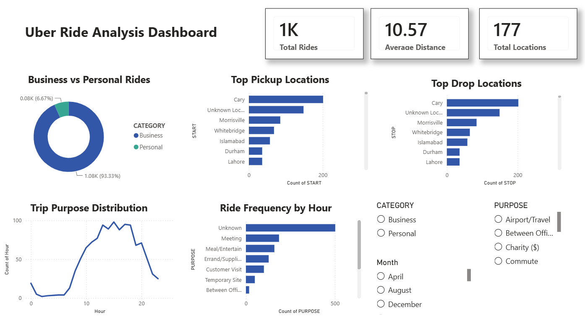

# Uber Ride Pattern Analysis

## Project Overview
This project analyzes Uber ride data to identify ride patterns, trip purposes, popular locations, and travel trends using Python, SQL, and Power BI.

## Tools Used
- Python
- Pandas
- NumPy
- Matplotlib
- Seaborn
- MySQL
- Power BI

## Project Workflow
1. Data Cleaning using Python
2. Feature Engineering
3. SQL Analysis
4. Interactive Dashboard Development in Power BI

## Key Insights
- Total Rides: 1154
- Average Trip Distance: 10.57 Miles
- Most rides were Business trips
- Cary was the most frequent pickup and drop location
- Meeting was one of the most common ride purposes

## Files
- Uber_Ride_Pattern_Analysis.ipynb
- uber_cleaned.csv
- uber_sql.sql
- Uber Ride Analysis Dashboard.pbix

## Dashboard Preview

## Author
Tanishka Jain
